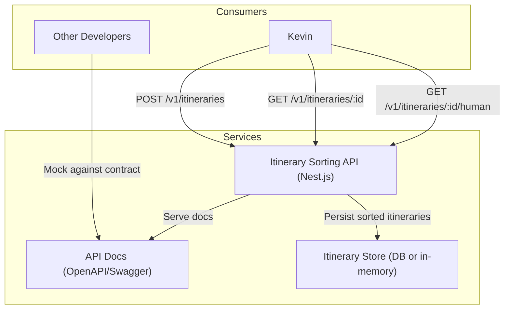
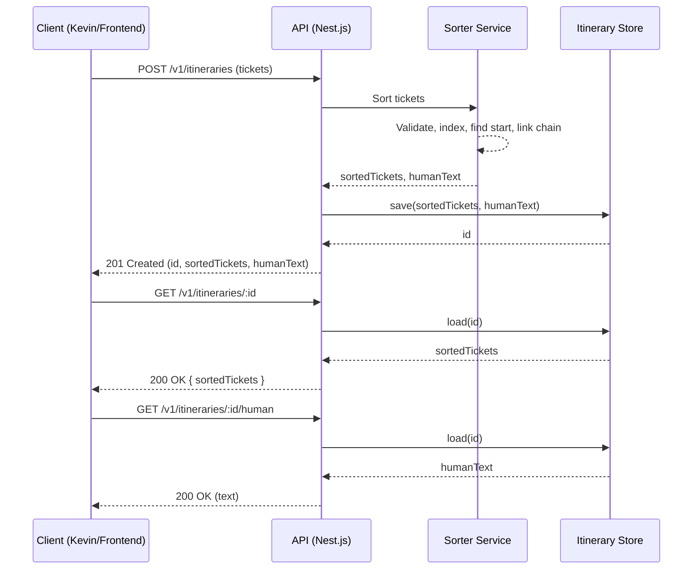
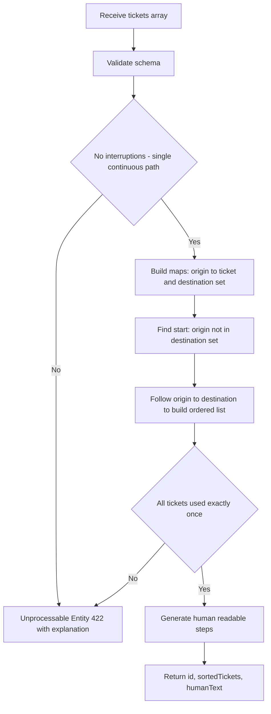

# Itinerary Sorting API

This project is a solution to the "Kevin McCallister is Lost in Europe" challenge. It's a Nest.js-based REST API that takes a list of unsorted travel tickets, sorts them into a coherent itinerary, and provides endpoints to retrieve the result.

## Features

-   Sorts a list of travel tickets into a continuous itinerary.
-   Handles invalid itineraries (e.g., broken chains, cycles).
-   Persists sorted itineraries in memory.
-   Provides endpoints to retrieve sorted itineraries in JSON or human-readable format.
-   Includes interactive API documentation via Swagger.
-   API versioning using URI versioning (current: v1)
-   Consistent error responses using RFC7807 (application/problem+json)

---

## Getting Started

### Prerequisites

-   [Node.js](https://nodejs.org/en/) (v18 or higher recommended)
-   [pnpm](https://pnpm.io/) package manager

### Installation

1.  Clone the repository:
    ```bash
    git clone <repository-url>
    ```
2.  Navigate to the project directory:
    ```bash
    cd genty
    ```
3.  Install the dependencies:
    ```bash
    pnpm install
    ```

### Running the Application

```bash
# Start the development server with hot-reloading
pnpm run start:dev
```

The application will be running on `http://localhost:3000`.

---

## Running Tests

This project uses Jest for end-to-end (e2e) testing.

To run the tests, execute the following command:

```bash
pnpm run test:e2e
```

---

## API Documentation

Once the application is running, you can access the interactive API documentation (Swagger UI) by navigating to:

[http://localhost:3000/api](http://localhost:3000/api)

The documentation provides detailed information about the available endpoints, their parameters, and response schemas. You can also use it to send requests to the API directly.

---

## Try the API with REST Client (VS Code)

This repo includes ready-to-run requests for the VS Code REST Client extension.

1) Install the extension: [REST Client (by Huachao Mao)](https://marketplace.visualstudio.com/items?itemName=humao.rest-client)
2) Start the API locally (`pnpm run start:dev`)
3) Open any of the files under `http-requests/` and click “Send Request” above a request block:
   - `http-requests/POST_itineraries.http`
   - `http-requests/GET_itinerary_by_id.http`
   - `http-requests/GET_itinerary_human.http`

Notes:
- These files define variables at the top:
  - `@host = http://localhost:3000`
  - `@version = v1`
  - `@baseUrl = {{host}}/{{version}}`
- You can change `@version` to try future versions when available.
- For the GET examples, the file first creates an itinerary and then uses the returned `id` in the subsequent request.

---

## Example Usage

Here is an example of how to sort an itinerary using `curl`.

```bash
curl -X POST 'http://localhost:3000/v1/itineraries' \
--header 'Content-Type: application/json' \
--data-raw '{
  "tickets": [
    {
      "origin": "Innsbruck Airport",
      "destination": "Venice Airport",
      "transport_type": "flight",
      "details": {
        "vehicle_id": "AA904",
        "seat": "18B",
        "gate": "10",
        "notes": "Self-check-in luggage at counter."
      }
    },
    {
      "origin": "St. Anton am Arlberg Bahnhof",
      "destination": "Innsbruck Airport",
      "transport_type": "train",
      "details": {
        "vehicle_id": "RJX 765",
        "seat": "17C"
      }
    },
    {
      "origin": "Venice Airport",
      "destination": "Home",
      "transport_type": "taxi",
      "details": {
        "notes": "The final ride home."
      }
    }
  ]
}'
```

---

## Design Choices & Assumptions

### Input Format

The problem description did not specify a strict input format for the tickets. I have defined a flexible JSON structure that includes:
-   `origin` (string, required)
-   `destination` (string, required)
-   `transport_type` (string, required)
-   `details` (object, optional) containing any other relevant information (`seat`, `gate`, `vehicle_id`, etc.).

This structure is enforced by DTOs and `class-validator`.

### Persistence

The application uses a repository abstraction with an in-memory implementation to persist sorted itineraries. In a production environment, this can be swapped for a database-backed repository (e.g., PostgreSQL, MongoDB, Redis) via an ORM.

### Extensibility: Adding New Transit Types

The current design makes it easy to add new types of transit. The `transport_type` is a simple string, and the `details` object can accommodate any new fields without requiring changes to the core sorting logic.

For example, to add a "boat" transit type with a "cabin_number", you would simply include a ticket in the request like this:

```json
{
  "origin": "Port A",
  "destination": "Port B",
  "transport_type": "boat",
  "details": {
    "vehicle_id": "The Salty Seahorse",
    "cabin_number": "C-12"
  }
}
```

The human-readable rendering is handled by the `Itinerary` entity, which can be extended to recognize new transport types and optional details. The sorting algorithm itself requires no changes.

---

## Error Responses (RFC7807)

Errors follow the IETF standard RFC 7807 (Problem Details for HTTP APIs). See [RFC 7807 (IETF)](https://datatracker.ietf.org/doc/html/rfc7807) for details. This provides a consistent, machine-readable error contract across endpoints.

Errors use media type `application/problem+json` and expose:
- `type`: URI reference identifying the error type (defaults to `about:blank`)
- `title`: short, human-readable summary
- `status`: HTTP status code
- `detail`: human-readable explanation
- `instance`: request path
- `errors` (optional): validation details when present

Example 422 response:

```json
{
  "type": "about:blank",
  "title": "Unprocessable Entity",
  "status": 422,
  "detail": "Invalid itinerary: broken chain.",
  "instance": "/v1/itineraries"
}
```

---

## Versioning

All API endpoints are versioned under `/v1`. Example:

- `POST /v1/itineraries`
- `GET /v1/itineraries/:id`
- `GET /v1/itineraries/:id/human`

---

## Goals & Requirements Checklist

The following tracks the requirements from the challenge goal and their status:

- [x] All code written in Nest.js
- [x] README with how to run the code, tests, and a working example
- [x] Document input/output, responses, and exceptions (Swagger at `/api`, DTOs, and RFC7807)
- [x] Decoupled, reusable, and scalable design (entity + repository + service separation)
- [x] Assumptions noted (ticket input structure defined in README/DTOs)
- [x] Suggest ways to add new transit types (see Extensibility section)
- [x] Algorithm works for itineraries with a single continuous path (validated, 422 on interruptions)
- [x] Tests (e2e) verifying sorting, errors, and versioned routes

---

## Diagrams

### System Context



### Request/Response Sequence



### Sorting Algorithm Flow



---

## Next Steps

See `next-steps.md` for ideas that can evolve this API if the project continues. Examples:

- Add an ORM (e.g., TypeORM/Prisma) and implement a database-backed repository
- Deprecation strategy for future API versions (v2, v3)
- Observability (structured logging, metrics)
- Additional endpoints (listing, delete)

We kept the project easy to test and reason about to focus on being decoupled, reusable, and scalable.