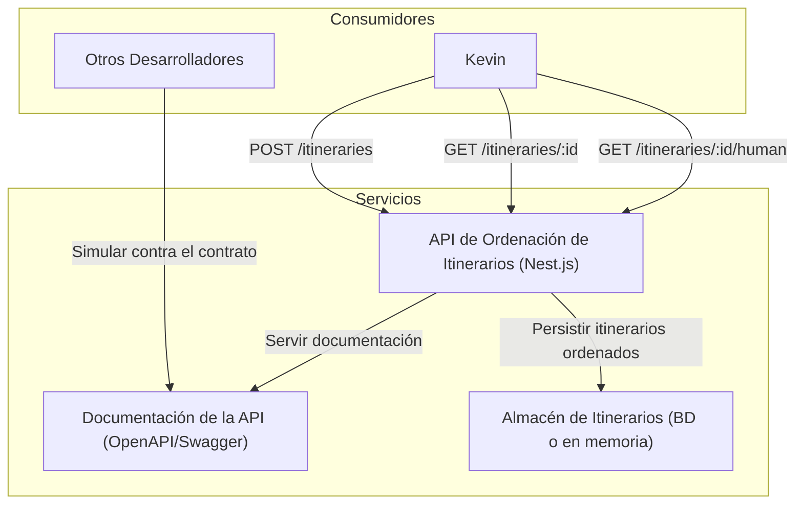
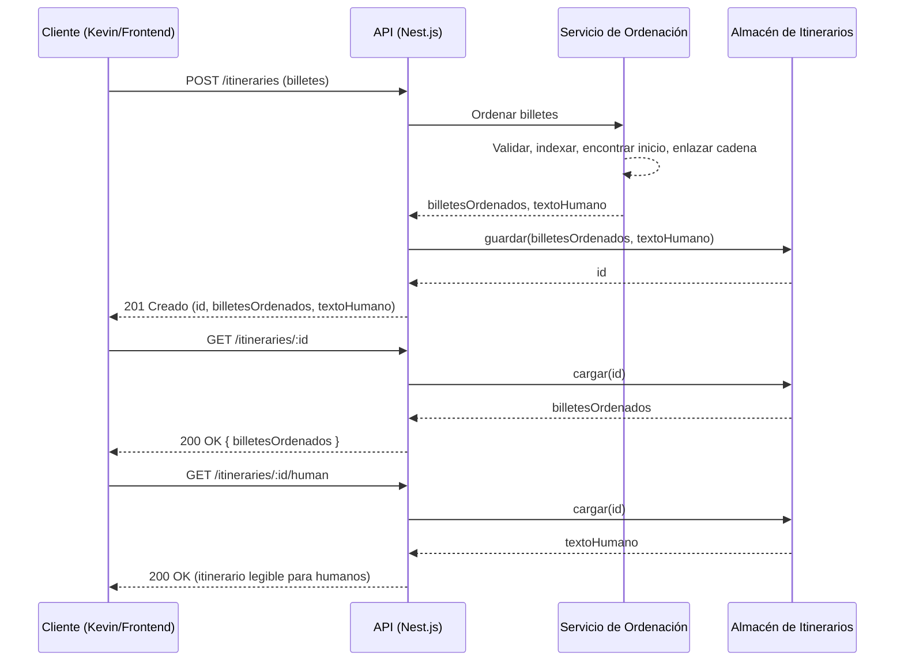
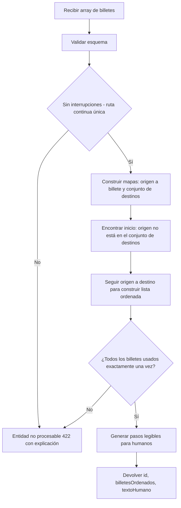

# Kevin McCallister está perdido en Europa

¡Los McCallister lo han vuelto a hacer!

## Historia de fondo

Después de meses de búsqueda y planificación de unas vacaciones de Navidad de tres semanas, encontraron la combinación perfecta de viaje y alojamiento para su numerosa familia. Para conseguir la forma más barata de cruzar Europa, tuvieron que reservar múltiples billetes para varios medios de transporte de un lugar a otro.

La primera parada fue una estación de esquí en St. Anton, Austria. Después de una semana fantástica que incluyó esquí, ponche de huevo y mirar la chimenea, tuvieron que salir a toda prisa por la mañana temprano hacia el siguiente destino, por lo que, una vez más, se olvidaron de Kevin.

Al despertar, Kevin descubre que lo han vuelto a dejar atrás. Esta vez no entró en pánico. Esta vez las cosas serán diferentes porque ahora tiene experiencia en este tipo de situaciones. Decide evaluar sus opciones al descubrir que su familia se fue 5 horas antes. Por suerte para él, descubre que tiene todos los billetes necesarios para el resto de las vacaciones planeadas.

En lugar de irse directamente a casa, decide que intentará alcanzar a su familia y, con suerte, disfrutar del resto de las vacaciones.

Como es un niño listo, se las arregla para hablar con el dueño del resort, y encuentran la manera de extender la validez de todos los billetes, para que no tenga que preocuparse por la hora escrita en ellos.

## El Problema

Kevin no tiene el itinerario de las vacaciones, por lo que no sabe a dónde se dirige su familia a continuación. Tiene todos los billetes que necesita para llegar a cada parada, pero desafortunadamente, son muchos billetes y no están en el orden correcto.

Antes de dejar el resort, necesita ordenar los billetes en el orden correcto en caso de que no alcance a su familia en ninguna de sus próximas paradas. Cada billete contiene detalles sobre el tipo de transporte (autobús, barco, taxi, avión) y cualquier detalle relevante.

## La Solución

Kevin te encuentra, un desarrollador habilidoso, y te pide ayuda para construir una API REST que él pueda usar.

## Tu Tarea

Ordena los billetes para descubrir el itinerario completo de las vacaciones de los McCallister y dale a Kevin la mejor oportunidad de alcanzarlos.

Crea una API REST que tenga un endpoint que acepte todos los billetes como entrada, los ordene de principio a fin y devuelva los billetes ordenados, junto con un identificador que se pueda usar para recuperar todo el itinerario según sea necesario.

Bajo demanda, tu API también debería poder generar una versión legible para humanos, como se ilustra a continuación.

## Ejemplo de Itinerario Legible para Humanos

0.  Inicio.
1.  Tomar el tren RJX 765, Andén 3 desde St. Anton am Arlberg Bahnhof a Innsbruck Hbf. Asiento número 17C.
2.  Tomar el tranvía S5 desde Innsbruck Hbf al aeropuerto de Innsbruck.
3.  Desde el aeropuerto de Innsbruck, tomar el vuelo AA904 al aeropuerto de Venecia desde la puerta 10, asiento 18B. Auto-facturación de equipaje en el mostrador.
4.  Tomar el tren ICN 35780, Andén 1 desde Gara Venetia Santa Lucia a Bologna San Ruffillo. Asiento número 13F.
5.  Tomar el autobús del aeropuerto desde Bologna San Ruffillo al aeropuerto Guglielmo Marconi de Bolonia. Sin asignación de asiento.
6.  Desde el aeropuerto Guglielmo Marconi de Bolonia, tomar el vuelo AF1229 al aeropuerto de París CDG desde la puerta 22, asiento 10A. Auto-facturación de equipaje en el mostrador.
7.  Desde el aeropuerto de París CDG, tomar el vuelo AF136 a Chicago O'Hare desde la puerta 32, asiento 10A. El equipaje se transferirá automáticamente desde el último vuelo.
8.  Último destino alcanzado.

## Contrato de la API

Para poder trabajar rápidamente con otros desarrolladores, necesitas definir un contrato tanto para la entrada como para la salida de tu API, de modo que los otros desarrolladores puedan simularla hasta que hayas terminado la tarea.

## Especificaciones

-   La salida debe ser compatible con la entrada.
-   Documenta la entrada y salida de tu API, los tipos de respuestas y las excepciones con cualquier herramienta adecuada o familiar.

## Requisitos

-   Todo el código debe estar escrito en Nest.js. Puedes usar librerías de terceros para la interfaz de usuario (si es necesario), datos (p. ej., TypeORM), pruebas unitarias (p. ej., Jest), análisis de código (p. ej., ESLint) y documentación (p. ej., @nestjs/swagger).
-   Crea un archivo README con detalles sobre cómo ejecutar el código, las pruebas y un ejemplo funcional de la API.
-   Asegúrate de que tu código esté desacoplado, sea reutilizable y escalable.
-   Si encuentras que falta alguna información que necesitas, haz y anota suposiciones en el archivo README.
-   Sugiere formas de agregar nuevos tipos de transporte con diferentes características.
-   El algoritmo debe funcionar con cualquier tipo de billete para itinerarios que no tengan interrupciones.

## Evaluación

Para la solución que proporciones, analizaremos: cómo escribes y estructuras tu código; tu comprensión de las estructuras de datos; la eficiencia del algoritmo de ordenación que implementes; y tu capacidad para ofrecer una solución apropiada y sencilla a un problema dado.

## Diagramas

### Contexto del Sistema

### Secuencia de Petición/Respuesta

### Flujo del Algoritmo de Ordenación

