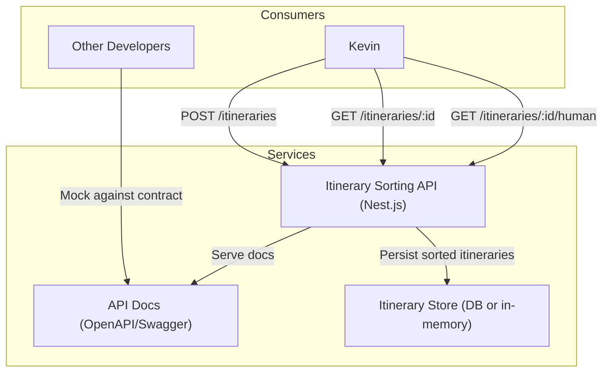
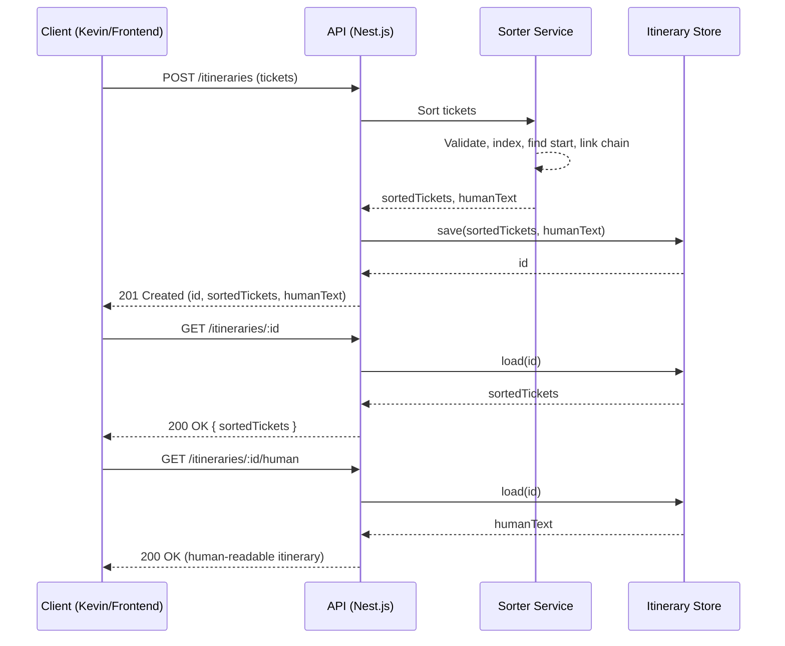
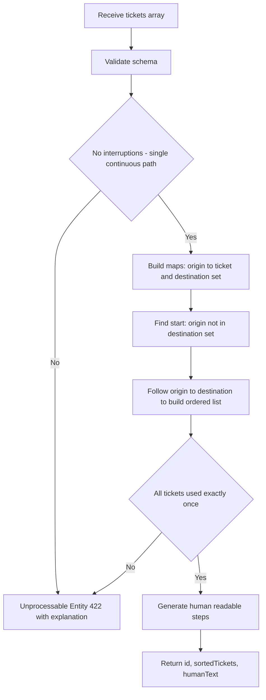

# Kevin McCallister is Lost in Europe

The McCallisters have done it again!

## Backstory

After months of searching and planning a three-week Christmas vacation, they found the perfect travel and accommodation combination for their very numerous family. To get the cheapest way across Europe they had to book multiple tickets for several methods of transportation from one place to another.

The first stop was a ski resort in St. Anton, Austria. After a great week that involved skying, eggnog, and looking at the fireplace, they had to leave in a rush early in the morning for the next destination, as such, they once more forgot about Kevin.

After waking up, Kevin finds out that he was again left behind. This time he did not panic. This time things will go differently because now. He has experience in such situations. He decides to evaluate his options as he finds out that his family left 5 hours ahead. Luckily for him, he discovers that he has all the tickets needed for the rest of the planned vacation.

Instead of going straight home, he decides he will try to catch up to his family and hopefully enjoy the rest of the vacation.

Because he is a smart kid, he manages to talk to the resort owner, and they find a way to extend the availability of all the tickets, so he does not have to worry about the time written on the ticket.

## The Problem

Kevin does not have the vacation itinerary, as such, he does not know where his family is going next. He has all the tickets he needs to get to each stop, but unfortunately, there are a lot of tickets, and they are not in the right order.

Before he leaves the resort, he needs to sort the tickets in the correct order in case he does not catch up to his family in any of their next stops. Each ticket contains details about the type of transit (bus, boat, taxi, airplane) and any relevant details.

## The Solution

Kevin finds you, a skilled developer and asks for your help to build a REST API for him to use.

## Your Task

Sort the tickets to discover the complete itinerary for the McCallister’s vacation and give Kevin the best chance to catch up to them.

Create a REST API that has an endpoint which accepts all the tickets as the input, sorts them from start to end and returns the sorted tickets, along with an identifier that can be used to retrieve the whole itinerary as needed.

On demand, your API should also be able to output a human-readable version, as illustrated below.

## Example Human-Readable Itinerary

0. Start.
1. Board train RJX 765, Platform 3 from St. Anton am Arlberg Bahnhof to Innsbruck Hbf. Seat number 17C.
2. Board the Tram S5 from Innsbruck Hbf to Innsbruck Airport.
3. From Innsbruck Airport, board the flight AA904 to Venice Airport from gate 10, seat 18B. Self-check-in luggage at counter.
4. Board train ICN 35780, Platform 1 from Gara Venetia Santa Lucia to Bologna San Ruffillo. Sear number 13F.
5. Board the airport bus from Bologna San Ruffillo to Bologna Guglielmo Marconi Airport. No seat assignment.
6. From Bologna Guglielmo Marconi Airport, board the flight AF1229 to Paris CDG Airport from gate 22, seat 10A. Self-check-in luggage at counter.
7. From Paris CDG Airport, board the flight AF136 to Chicago O'Hare from gate 32, seat 10A. Luggage will transfer automatically from the last flight.
8. Last destination reached.

## API Contract

In order to work fast with other developers, you need to define a contract for both the input and the output of your API so that the other developers can mock it until you are done with the task.

## Specs

- The output should be compatible with the input.
- Document the input and output of your API, the types of responses, and exceptions with any proper or familiar tools.

## Requirements

- All code must be written in Nest.js. You can use 3rd party libraries for UI (if needed), Data (e.g., TypeORM) Unit Testing (e.g., Jest), code analysis (e.g., ESLint) and documentation (e.g., @nestjs/swagger).
- Create a README file with details about how to run the code, tests, and one working example of the API.
- Make sure your code is decoupled, reusable, and scalable
- If you find that any information you need is missing, make and note assumptions in the README file.
- Suggest ways to add new types of transit with different characteristics.
- The algorithm should work with any kind of ticket for itineraries that have no interruptions.

## Evaluation

For the solution you provide, we will be looking at: how you write and structure your code; your understanding of data structures; the efficiency of the sorting algorithm you implement; and your ability to deliver an appropriate, simple solution to a given problem

## Diagrams

### System Context

### Request/Response Sequence

### Sorting Algorithm Flow

